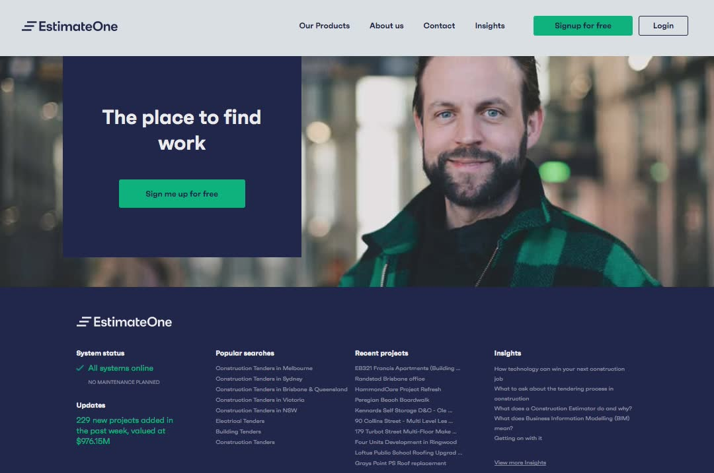
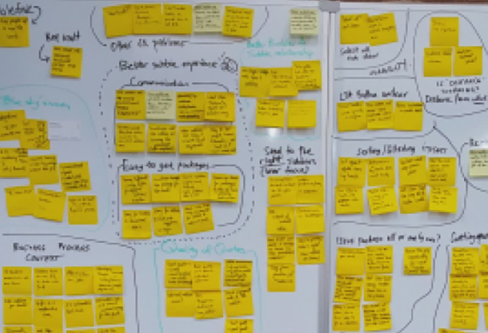
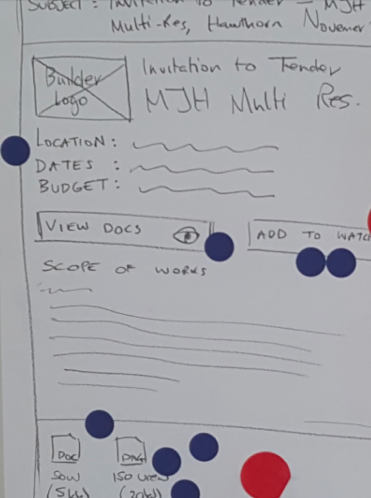
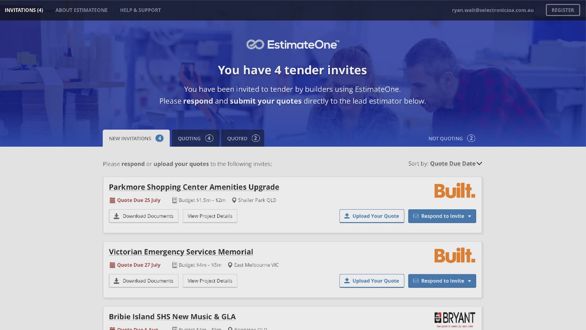
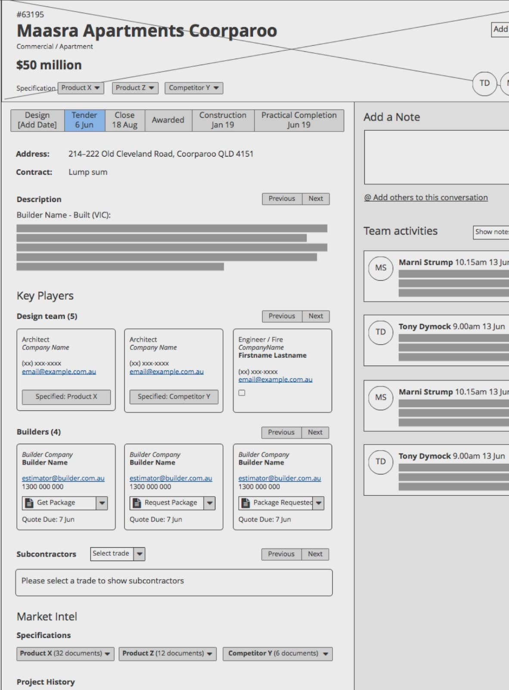
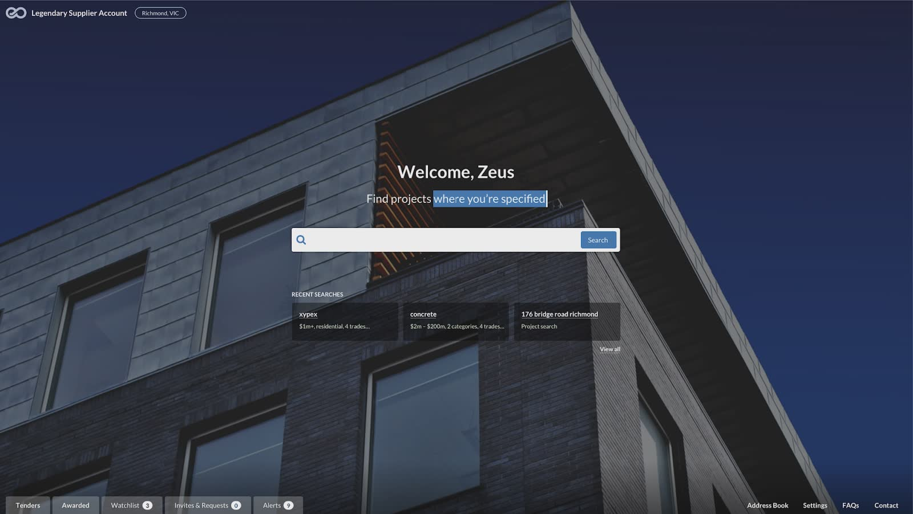

# Scaling a startup and innovating the construction industry

## Product background

 I worked across all product teams to gain in-depth domain knowledge and designed complex interactions between different user groups' interests to improve the efficiency and reliability of commercial construction operations. I advocated design practices during EstimateOne’s growth and adoption of product methodologies to evolve from a startup to a scaling product company.

### My responsibilities

End-to-end UX design:
- Facilitate design workshops
- Customer research and usability testing
- UI design
- ReactJS development

### Team structure

As the UX designer, I reported directly to the CEO. I worked alongside another UX designer, three product stream leads and closely with engineers from all three product teams and subject matter experts.

The three products were:
1. **Builders**: tender stage and construction stage management
1. **Suppliers**: find projects their brands are specified
1. **Subcontractors**: find new project opportunities

## Builder product

### Increase subcontractor engagement with the builder product

EstimateOne’s builder clients wants to increase the number of subcontractors to respond with quotes to help them win the tender. Some builders were concerned about low response rates and so we conducted a series of interviews with builders to better understand their motivations and behaviour.

### Invalidating the builders' assumption

We met with estimators from small to large construction companies to chat about their context and then observed how they use EstimateOne. Collectively, we found an interesting workaround they do to attach a ‘scope of work’ document and every builder adamantly believed personalising their quote invitations will increase their response rate.

My curiosity led me to conduct interviews with the subcontractors to hear the other side of the story. Contrary to the builders’ assumption, subcontractors are more willing to work with a builder if they pay on time and are easy to work with, so personalising invite won’t make them more appealing. They are also too time-poor to read the ‘scope of work’.

### Ideating with sketch workshops

We synthesised the customer interviews and presented our learnings to the wider teams. We falsified the biggest misconceptions around personalisation and scope of work. After informing the team with insights, we collaborated with a sketch workshop to ideate. The sketching became a regular practice to kick-off new feature designs.

### From idea to delivery

We built several features from the sketches. One of the most interesting experiment we build was tender pages for non-member subcontractors. This helped with the builders’ objective to increase quotes, by increasing their tenders’ exposure and lowering the barrier of entry for subcontractors to participate. It also allowed us to further study the subcontractors’ behaviour to help inspire future features.

## Supplier product

### Launching a new opportunity

EstimateOne’s supplier feature is a greenfield product that helps construction supplier BDMs to find more leads and gather market intel. The product organically emerged from suppliers creating subcontractor accounts to gather more construction data. I worked closely with the team to facilitate discovery research, design workshops, prototyping, high fidelity design, as well as building ReactJS components to help push new features under tight deadlines.

### Kick-off the discovery with Lean Canvas

We started with different models of the product and varying assumptions about out customers. To kick off the product, we mapped our thoughts on a lean canvas and identified the customer segment section as the riskiest. I participate in various research methods, such as competitor analysis, 'desktop research' (scouring through LinkedIn) and customer interviews. Throughout each research activity we iterated the lean canvas and falsifying most of the initial hypotheses.

### Early customer research

We used many different research methods, from simple desktop research (going through LinkedIn profiles), customer interviews, prototype testing and field visits. We identified 2 customer segments that we wanted to target — established teams and growing teams, and summarised the product with the following job story.

> When I’m looking for new sales opportunities, I want to know where, and when, my product is needed, so I can maximise our chance to win the deal.

### From ideation to low fidelity concept

After sharing customer insights with the team I set up design workshops to brainstorm, prioritise and sketch ideas. Then I reviewed all the ideas with the product manager to put together the low fidelity design.

### Designing and building a new search paradigm

We built many improvements to slowly iterate the Supplier product forward. One of the main work-in-progress feature was shifting the user experience from browsing tables of leads to a dashboard pattern, which opens opportunities to prioritise search, push notification and personalisation.
