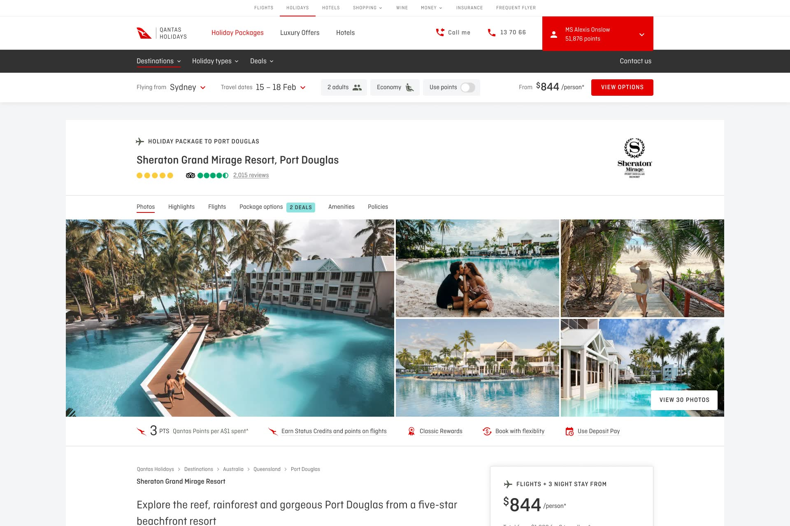
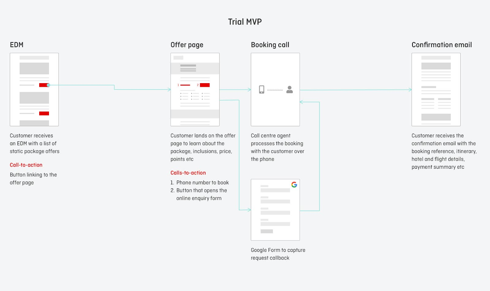
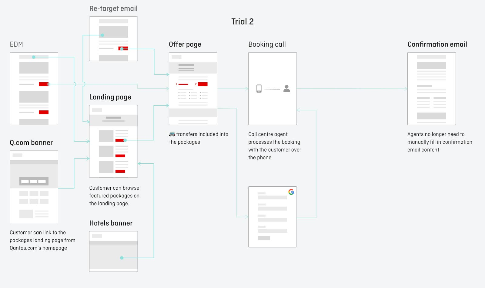
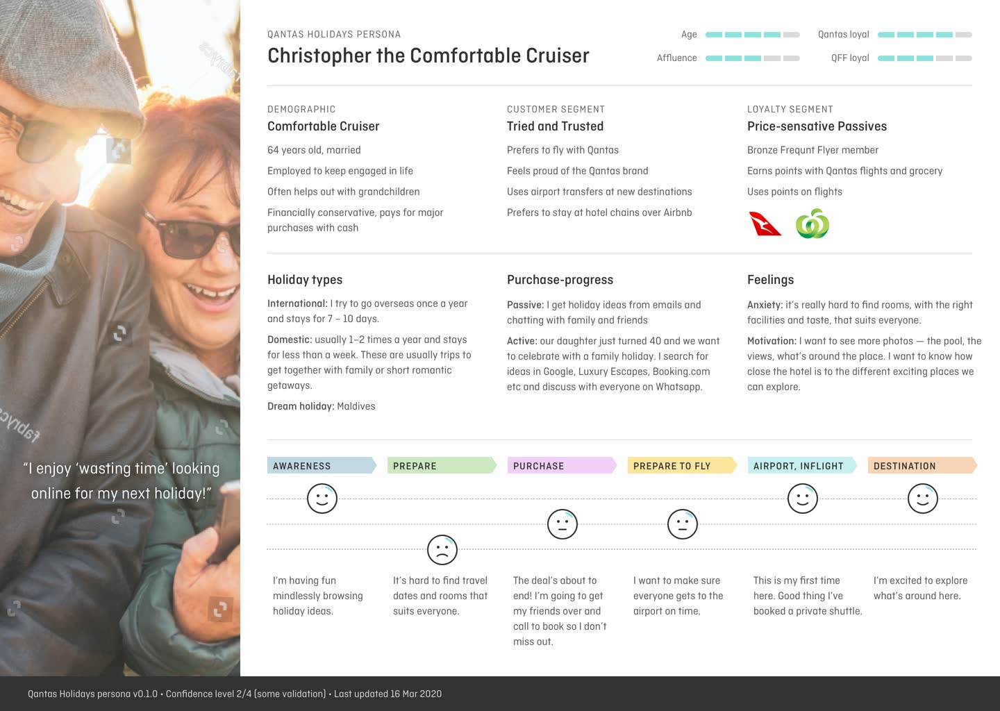
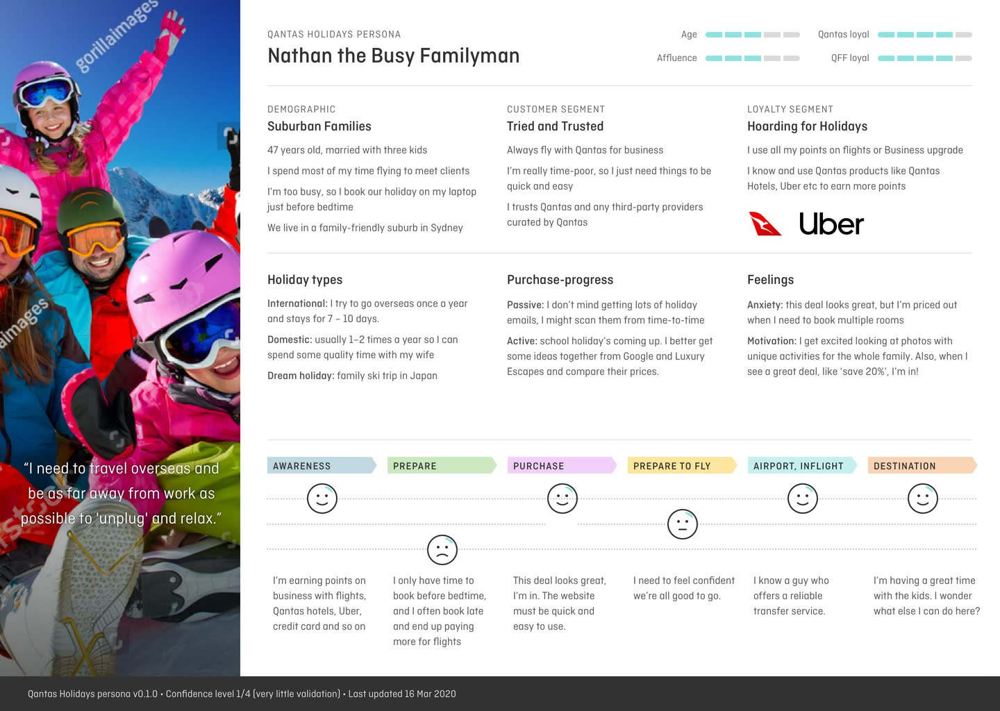
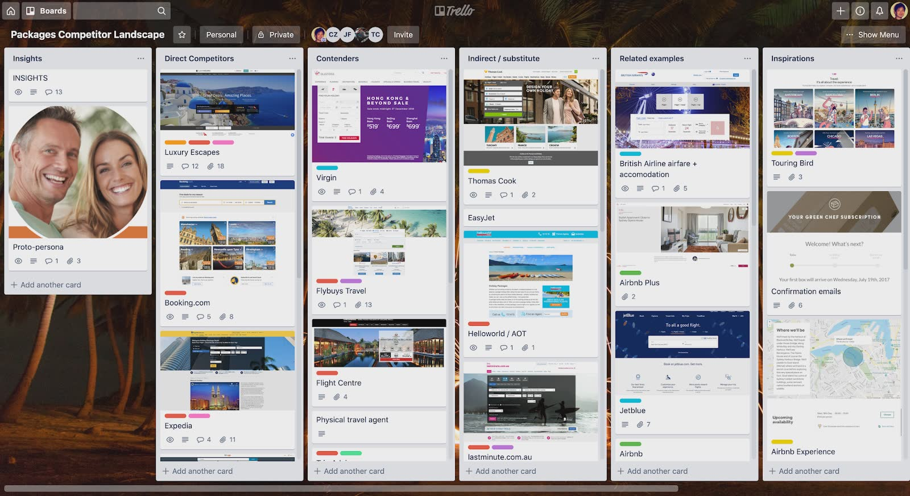
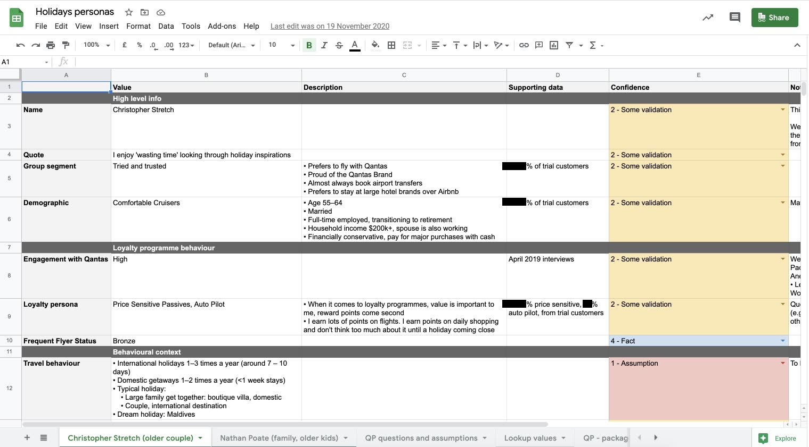
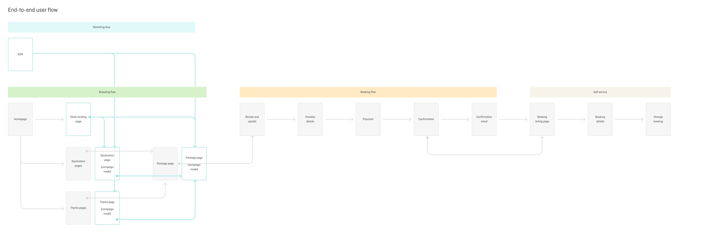
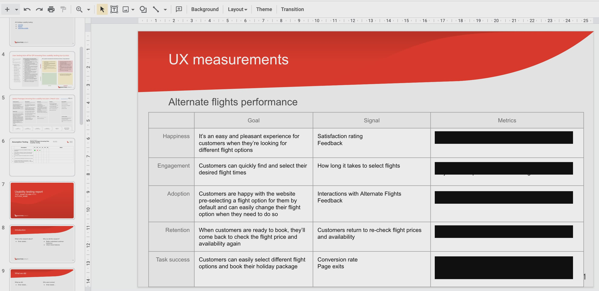
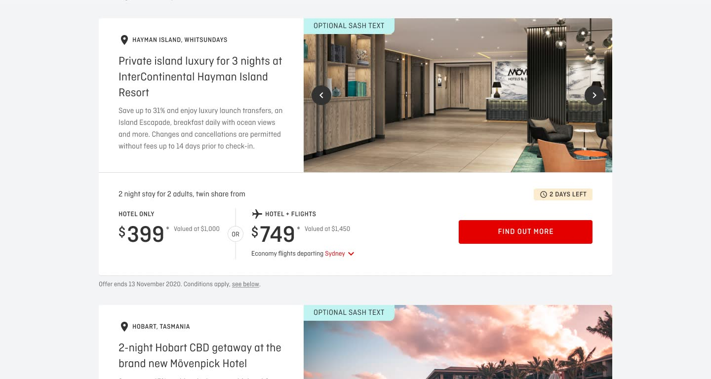

# Launching the new Qantas Holidays product from Concierge MVPs to the end-to-end booking flow

## Product background

Qantas Hotels aspires to become Australian's accommodation provider of choice. However, most hotel bookings are short 1–2 day stays and we wanted to expand into the longer, high consideration leisure and luxury stays. Secondly, the OTA (Online Travel Agency) market is fiercely competitive and we wanted to develop the expertise and competitive edge within Qantas and reclaim the Qantas Holidays brand that was licensed to a 3rd party partner. Lastly, by gaining more market share within the leisure sector, we can help the airline business to sell more flights and eventually roll out more routes. The new Qantas Packages team, now the Qantas Holidays Squad, was formed to take on this challenge.

### My responsibilities

End-to-end UX design:

- Product discovery workshops
- Customer research and user testing
- Creating the Concierge MVP and prototyping for usability testing
- UI design
- Development support
- Post-release testing
- Collaborate with marketing to drive acquisition
- Support and gather insight from customer ops
- Custodian for working documentation

### Team structure

- Leadership: Squad lead and product manager
- UX: Design lead (myself)
- Engineering: Tech leads, frontend and platform engineers (booking and search services)
- Sales & marketing: Marketing manager, marketing coordinator, account managers
- Customer support: Sales agents and support team

### Key outcomes

- Launched a series of Concierge MVPs, where we validated:
  - There is demand for Qantas holiday packages
  - The correct structure to merchandise our holidays
  - We can bundle flights with hotels, as well as other products like cruise
- Launched the Qantas Holiday brand
- Triple digit growth for the luxury holiday product
- Grew the UX maturity through collaborative kick-offs, working documentation, remote ways-of-working and focus on team culture
- Delivered multiple campaigns to stay engaged with the customers

Achieved all the above during a pandemic.

## The key challenges

The product challenges were to 1. grow leisure bookings and gain market share as quickly as possible, 2. create a compelling customer value proposition and a premium customer experience and 3. integrate with flights and booking services to provide the UX for customers to book online.

Our hypothesis was that Qantas customers desire longer stay and international destinations, and by offering a quality range of hotel plus flights holiday packages, customers will be delighted to book and we'll increase both our number of bookings and average booking value.

## Validated learning through Concierge MVPs

Instead of forming a fully cross-functional product team, we kicked off with just three members — product manager, tech lead and myself the UX. 

We tested our hypothesis with a series of Concierge MVP in the form of trial campaigns. The product manager worked with sales & marketing to procure a few hotel package deals and acquired a million email newsletter sends to reach Qantas Frequent Flyer member, and trained a Qantas call centre team to sell holiday packages. The tech lead created a rudimentary agent booking tool for the call centre to create bookings. I created the 'no code' campaign pages with our CMS to showcase the holiday packages, added the call centre's phone number as the main call-to-action and created a request callback form with Google Form and Google Sheets that could be batch imported into the call centre's CRM.

After the first round of the trial we have learned the following:
- There is demand for Qantas holiday packages
- Booking data gave us valuable insight into who our customers are
- Technical knowledge about how flights pricing and availability work

With each trial, we incrementally added experiments and gradually grew our team's capability to deliver more features.

The most important validation was finding the right product model — offer customers with a few curated hotels. Our original idea was to offer 'dynamic packages', whereby we dynamically couple all the hotel inventory with flights. However, from the Concierge MVPs we've learned that our target customers want convenience, not decision-paralysis, and they trust Qantas to curate the best experience for them.

With this knowledge, we finally launched the first end-to-end online booking process in February 2020. After the pandemic forced border closured in March, we prioritised customer support and weeks later I returned to design the product. In October, we finally launched the Qantas Holidays brand with key domestic routes.

## Getting to know our customers

Our early adopters were obviously amongst the 12 million Qantas Frequent Flyer members. Throughout each iteration we gathered more data to gradually get a clearer picture of who we should focus on.

In parallel with creating the early Concierge MVPs I spent a lot of time doing contextual research, which included talking to holiday go-ers, reviewed existing customer research, conducting competitor analysis and creating proto-personas using both qualitative and quantitative data.

Wherever possible, I always try to get facetime with customer and involve team members with user testing sessions. I have also created templates for user testing scripts, research briefs and screeners, as well as coaching other team members to run user testing sessions.

### Early customer interviews

A few days I joined Qantas, I heard that I'll be joining the Holidays team, so I hired people via Airtasker to learn about their desirability for holiday packages. I learned that even though people enjoy spending hours planning and exploring different holiday options, they are happy to book a holiday package with enough saving to justify the time-saving, provided that there's a slight layer of flexiblity or modularity (e.g. optionally bundle activities, travel insurance, car hire, transfers etc). People also trust Qantas and millions of people are engaged with the Frequent Flyer programme and most will redeem their points on Qantas flights.

### Review existing customer research

Jetstar Holidays, our sister product, was launched before Qantas Holidays, so I spoke with their product manager to learn about their development experience and customer pain points. Interesting, the top customer pain point was the difficulty to find the promoted deals with their search UX. I learned about many technical hurdles to get flights price and availability. I made it a high priority for me to speak with our tech lead on a regular basis to learn about our flight service's intracacies to help me find opportunities to improve the UX.

### Competitor analysis

I extracted and collated more existing leisure customer from the Qantas Hotels team and started to map out the competitor landscape. I kept the process simple and used a Trello board to identify the competitors, or industry leaders, into these columns — direct competitors, contenders, substitutes and inspirations. In each of the competitor Trello cards I listed their strengths, weaknesses and Qantas' competitive advantage. This became a valuable source of inspiration as well as an interesting talking point with other team members.

### Data-driven proto personas

I created proto personas to help the team to understand and empathise with our target customers. I started by exporting customer data from the bookings we made from the Concierge MVPs. Then I drafted the personas in Google Sheets, for ease of continuous improvement, and referred to raw data to enter the key attributes, such as demographic, holiday research and booking behaviour, loyalty programme behaviour, purchase decisions and customer journey. Lastly, I created a very simple one-pager visual for ease of communication.

So far, I have only been able to confidently validate two proto-personas, which accounts for the majority of our booking so far, but there's always more room for further discovery.

### Validating the unique value proposition

I continued to refine our customer value proposition through new learnings from the Concierge MVPs, booking data and user testing. Our initial assumption of the value proposition was based on three components:
- Inspirational destinations
- Best value — the constituents are price, inclusions, points earn and points redemption
- Convenience — 'un-worry' me, don't make me think, just book and enjoy

Most of our early assumptions were accurate. However, speaking to customer after customer, I continuously hear the sentiment that they don't consider points earns as compelling as we initially thought. This learning encouraged the stakeholders to simplify our points earn proposition, which in turn allows us to simplify the UX and operations to focus on the key values.

Another important learning was price's role in the 'value formula'. Qantas customers almost always not looking for the cheapest offers and they are willing to pay a premium for peace of mind, such as booking flexiblity and convenience.

## Iterating the UX architecture with low fidelity designs

The 'future state' of Qantas Holidays' UX is always partially defined and changing based on our rapid learning (and of course, adapting to the pandemic). In light of this, most of my design artefacts are low fidelity user flows and wireframes.

Throughout each discovery and delivery initiative, I've leaned towards more cross-functional kick-offs and working documentation before touching any tools. The kick-offs and discoveries are vital to get the team across the business objectives, technical feasbility and resource constraints. 

User flows are effective to help the product team and stakeholders to understand the UX direction and wireframes are useful to illustrate the structure that could be aligned for both Qantas and Jetstar Holidays.

## Doing UI design amidst an evolving design system

The biggest UI design challenges I face is working with an evolving design system. Qantas is working to align all teams to the same GEL (Global Experience Language) but many product teams have been designing different styles or building with different technologies before the GEL was introduced. I favour speed to production over aesthetics because the former will generate faster learning and commercial gains.

In light of this, I collaborate closely with the wider design team to stay tuned to the latest updates to the GEL and create tickets for 'Lightning Days' (once a month we spend a day to make as many bite-sized fixes as we can). I also attend the engineers' frontend working groups when I can to share updates to the GEL and pitch for better practices, such as use of design tokens and better tooling.

## Continuous development support

I make sure the product team is involved, at the right level, through the design process. I initiate every design with a kick-off to gather everyone's ideas. I have regular check-in and design critiques within the team as well as with other designers. When the design meets the definition of ready I'll kick-off the build with the engineers and create a working document with usability considerations. Throughout the entire delivery cycle I make sure I'm always available to the engineers to answer any UX questions to unblock the work and have hard but transparent discussions together about quality and trade-offs. When the pull request is ready for deploy, when necessary I also do manual cross-browser and accessibility testing on staging.

## Continuous improvement

After a new feature is deployed I work with the product manager to identify metrics to measure the success. I use the appropriate tools, such as Google Analytics, heatmaps, screen recording and online surveys to gather quantitative data.

Unfortunately, due to limited resources during this time, we have limited capacity for A/B split testing. It's also challenging to run usability tests on a regular basis. Nevertheless, I always try to find the next best alternative, such as collecting signals from the production site or test features with colleagues from others teams or family members.

## Growing UX maturity

Depending on the team I work with I'll always adapt and evolve the UX maturity based on the team's needs. I've spent the most time with the Qantas Holidays team and I've gradually introduced more UX practices with the intent to achieve strategic goals and fostering an enjoyable team culture.

During the Concierge MVP days, it didn't make sense to do user testing on high fidelity prototypes because we weren't sure what the optimal customer experience would look like, so most learnings were gathered from real bookings and evaluative user tests on the live site.

As the codebase becomes more complex and dependencies increases. I've introduced more working documentation to help the team to understand the business goal, customer needs and technical discoveries. I've modified and entered popular canvases into Google Docs so it's easy to read and collaborate in real-time. I've also migrated from Sketch to Figma for our team and the frontend engineers' efficiency, remote collaboration and, more importantly, happiness have greatly increased.

Lastly, I collaborate closely with the wider design team to align and standardise our customer research practices. I've created template documents for end-to-end customer research, including artecfacts such as assumption testing, recruitment brief and screener, user research canvas, scripts in the form of spreadsheets and playback reports.

## Commercial success through the pandemic

This is a strange heading to summarise our experience during the global COVID-19 pandemic. Amidst the border closures and aircrews being stood down, I feel very fortunate that the Holidays product was considered an essential business unit and we continued to move our product forward during this time.

There were many emotional experiences working on the different critical initiatives. When COVID-19 was declared a pandemic and state emergency, I put my hand up to temporarily join the customer ops team to handle the sudden influx of cancellation requests. In a very short amount of time I had to learn how customer support works and adapt to impromtu process changes. It was heart breaking to hear first hand about the customers' financial woes and cathartic to resolve support tickets for customers who thanked us after being in the queue waiting for weeks. It was one of the most impactful way for me to learn about empathy.

Once customer support settled, I returned to my normal duties and continued to refine the end-to-end booking experience.

Surprisingly, our land-only luxury hotel packages were achieving triple digit growth during this time. Due to border restrictions between states, consumers still had strong urge to travel and intrastate holidays near capital cities were incredibly popular. To further this success, I supported the team to design the flows to make it easier for customers to package flights with land-only luxury hotels offers. Recently, we launched a city themed campaign with Tourism Australia, where I collaborated with marketing and product manager to create the best possible UX due to time constraints, which allowed for better price displays and make flights package option more prominent to drive conversion.

## Links

- Qantas Holidays website: [www.qantas.com/holidays](https://www.qantas.com/holidays)
- Storybook for `roo-ui`: [roo-ui.netlify.com](https://roo-ui.netlify.com) / [github.com/hooroo/roo-ui](https://www.github.com/hooroo/roo-ui)
