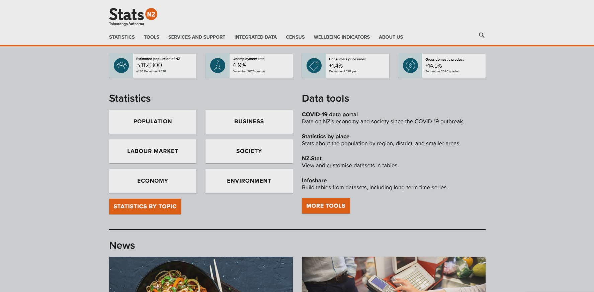
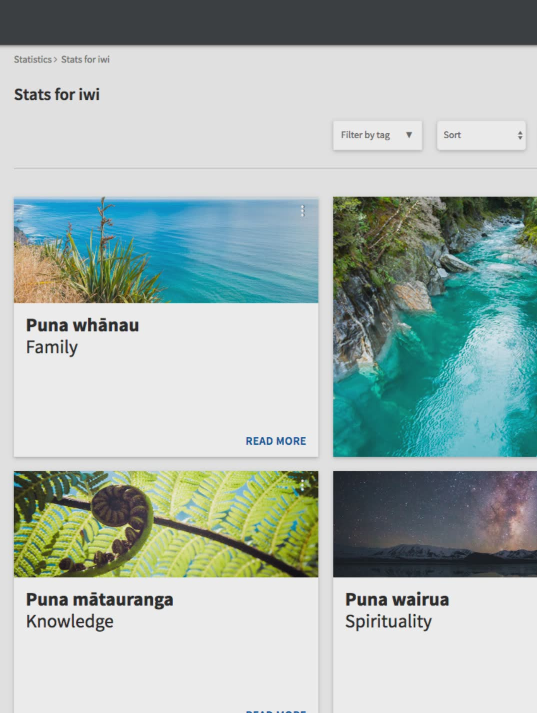

# Statistics New Zealand

Reinventing the statistics user experience

## Product overview

We worked with New Zealand's official data agency to redesign and rebuild their digital platform. Stats NZ wanted to make it easier for millions of people to access the data they need to make informed decisions with confidence. Their UX team chose to work with us to deliver the product and support them on their digital transformation journey to adopt new technologi and Agile methodologies.

### My responsibilities

- Build the design system
- Responsive UI design
- ReactJS development
- PHP development
- Produce the code prototype
- Advocate for inclusive design and web accessibility
- Co-author the frontend development styleguide to support the Stats NZ team to adopt new technology

### Team structure

- Our Agile team: Agile coach, engineer lead, frontend and backend engineers and myself as UX designer as well as a developer (Auckland-based)
- Stats NZ UX team: product owner, UX designers, frontend developer (Wellington-based)

## Kick-off one of the largest government web re-design and replatform

Stats NZ formed a new UX team to redesign their digital platform. They had ambitious goals to completely transform their technology platform and culture. Their UX team approached us to deliver a prototype to pitch for the full redesign, as well as our support to help them adopt Agile, Lean Startup and modern tech stack.

## Delivering the alpha proof-of-concept prototype

Stats NZ’s product owner formed a UX team and designed several visuals of a new card UI experience. He needed a prototype to be built before Christmas to present to the stakeholders deliver the pitch and get approval for the delivery.

The prototype's scope was:

- [Common Web Platform](https://www.cwp.govt.nz) as the backend platform and CMS
- ReactJS frontend

I worked closely with Stats NZ’s UX team and frontend developer to complete their visual concepts into end-to-end user flows and information architecture, and then worked with the frontend developers to coach them on new practices such as design systems, open source git workflow, development environment set up, Scrum and so forth.

## Building the design system

I worked with Stats NZ’s UX team to set up the foundations of their future design system. They had visual mockups of typography and pages. I worked closely with the visual designer to incorporate best practices in responsive design, Atomic design, web typography and accessibility. I built the first iteration of the design system with the frontend developers to ensure it is technology-agnostic and is scalable to support multiple themes in the future.

## Advocating for inclusive design and web accessibility

Ensuring WCAG 2.0 AA was essential for the redesign. I simplified accessibility documents for the teams, explained the reasons, introduced tools and created documentation. I also introduced UK Home Office’s accessibility guidelines to advocate for inclusive design as an essential practice and mindset, and not just an chore of ticking boxes for getting enough colour contrast.

## Frontend and backend development

We worked with different teams in the company to come up with the best tech stack for Stats NZ’s users. We proposed to build the frontend experience with ReactJS on the government’s Common Web Platform. After design problems were resolved with Stats NZ’s UX team, I worked with the frontend developers to upskill in ReactJS and explored its ecosystem to maximise its capability for the best possible user experience.

## Celebrating success

It was a long and challenging journey. We worked closely with Stats NZ's UX team to work through their complex information architecture publication workflow. After several trial and error we eventually defined the right solution to support their content.

Despite a 4 week project delay, due to time required for tech discovery, we managed to deliver the re-design and re-platform, and handed over rich documentation and a robust foundation for the Stats NZ teams to scale up their operations.

## Links

- Stats NZ homepage: [www.stats.govt.nz](https://www.stats.govt.nz/)
- Common Web Platform: [www.cwp.govt.nz](https://www.cwp.govt.nz)
