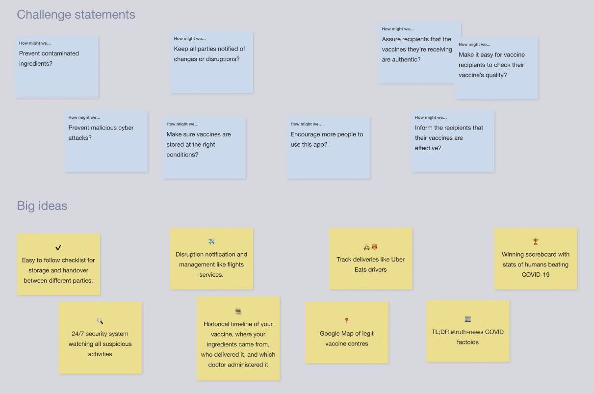
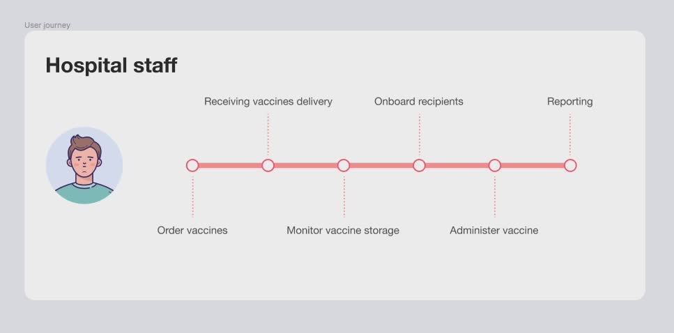

# End-to-end quality assurance for COVID-19 vaccines with blockchain

## Project overview

I'm working with the blockchain researchers at Swinburne University to create the UX for their proof of concept app. The stakeholder wants to leverage blockchain technology to ensure end-to-end quality and transparency of COVID-19 vaccine supply chain, from production to distribution. They needed a UX vision to guide their development.

### My responsibilities

UX discovery kick-off and UI design.

### Team structure

Swinburne blockchain researchers and UX consultant (me)

## Understanding the objective

I kicked off the project with Swinburne's lead researcher to understand the project's context, expected outcome, challenges and hypothesized solutions, which in summary were:

- Expected outcomes: end-to-end traceability, counterfeit prevention and steady transport and storage conditions
- Hypothesized solution: using blockchain to monitor the COVID-19 vaccine supply chain, provide real-time information on the vaccines' distribution

I also consulted with the researchers to guide me to high-level materials to help me better understand the subject matter and benchmark with other organisations who have solved the same problem.

## Identifying the users' needs

As a starting point, we kicked off the design discovery with hypothesized proto-personas based on the researchers' current domain knowledge. I synthesized their insights into four proto-personas:

### Manufacturers

- Pains: malicious cyber attacks, contaminated stock and ingredients
- Gains: strong cyber security, streamlined hand-off to distributors, transparency
- Job: vaccines are delivered correctly to the destination on time

### Distributors

- Pains: unexpected incidents during delivery, malicious attacks (cyber and physical)
- Gains: smooth delivery pipeline, well maintained storage conditions, delivery visibility and transparency
- Job: ensure the vaccines administered by health workers are safe and effective

### Hospital staff

- Pains: delivery delays and shortage, getting faulty vaccines, uncertainty due to lack of transparency
- Gains: timely delivery, certainty of vaccine condition and quality, being able to assure vaccine recipients
- Job: ensure the vaccine recipients' develop immunity and remains healthy, as much as possible

### Vaccine recipients

- Pains: uncertain about vaccine's effectiveness and safety, worried about what I heard on the news or social media (such as side effects and counterfeits)
- Gains: develop immunity, being able to safely interact with friends and family, help stop the spread
- Job: protected from COVID-19 and get back to my normal life, as much as I can

## Ideate for big ideas

After gathering user and industry insights, the next step was to come up with the big ideas. I start with some high level How-Might-We's, and then came up with ambitious Big Idea solutions to inspire the UX.

## Mapping out the user flows

I started low fidelity and sketch out very high level user journey flow first. These flows map out the critical tasks each persona must perform so I know what the UX solution should focus on.

## Mid-fidelity UI designs

I designed different UIs based on each persona's context. For manufacturers and distributors, my assumption was they will be mainly working in laboratory and office environments sorting through complex data, therefore I designed for large screen web applications. I skipped wireframing and went straight for mid-fidelity design as the research team and I both have enough shared knowledge to skip low-fidelity.

The web application interface displays the logistic content in a data table. This allows the users to easily view, sort or filter the data to find the desired data on the vaccines. Users could also use the global search to find data via unique ID or other parametres such as owner, location and so forth.

On the other hand, hospital staff and the general public are constantly moving between different locations. Secondly, I felt making these users use a new native app creates a barrier to entry as well as increases development costs. Therefore, I decided to provide the UX with mobile first responsive web apps and QR codes as the entry point.

For hospital staff, they can easier scan the shipments' QR code on arrival to check the log and trace the vaccines conditions all the way back to its source. After reviewing the details, they can choose to confirm and accept the package, or reject the package and inform every party involved in the pipeline.

The vaccine recipients can also easily scan the QR code to launch the web app to learn about the exact vaccine they're about to receive. The web app provides the recipient with official information about the vaccine to address common concerns using accessible English. The recipients can also trace the vaccine all the way back to its source in the production. Lastly, after the vaccine is administered, the recipients' vaccination status is updated which allows the respective parties to quickly update the public health records and follow up with the recipient later should there be any health concerns.

## Next steps

This project is work-in-progress. At the time of writing, the UX designs are currently being reviewed by Swinburne's research team and we expect more discovery and revisions are required. In the mean time, it has sufficient details to unblock the research to continue.

## Links

You can view the [COVID-19 UX design here](https://www.figma.com/file/FB8taUpTIyu7PAazM6t7GV/COVID-19-supply-chain?node-id=1%3A9245).

I've been working with Swinburne's blockchain research team on many projects. You can browse other projects via the links below:

- [DBS fintech hackathon](https://www.figma.com/file/NTiE7pfOHt758TlDVauN1I/Hackathon)
- [Shipping fresh lobsters globally on the blockchain](https://www.figma.com/file/bKIoc8PJnS5SCzGcgsImUQA2/Lobster?node-id=0%3A1)
- [Active cyber defence](https://www.figma.com/file/LB8DvuhAwpFAYL1lJAWG54/Traffic-product)
