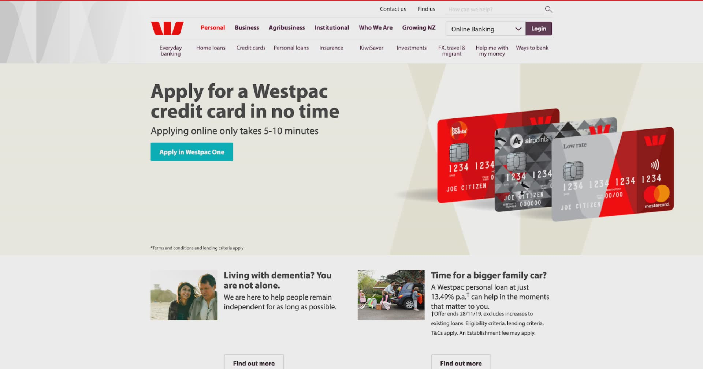

# Westpac NZ

Redesigning the largest web and brand re-design in the country

## Project overview

Westpac New Zealand wanted to the leader in the Australasian banking industry and provide their customers with outstanding online banking experience. The new website needed to align with their new brand and support customers with interactive features across different devices.

### My responsibilities

- Responsive web design
- Frontend development
- PHP development
- Web application development (AngularJS)
- Cross browser and web accessibility testing
- Advocate for Agile methodologies
- Usability testing

### Team structure

- SilverStripe Agile team: Agile coach, solution architect, frontend and backend developers, UX designer and developer (me)
- Westpac NZ: Product owner, content authors, senior stakeholders

## Going responsive, one page template at a time

When I first joined SilverStripe, Westpac was in their second iteration of web frontend re-build. They wanted to improve the website on mobile and the first solution that was built was an adaptive mobile theme. Whilst it did manage to render a different view for mobile users, it created a larger codebase to manage and the Javascript file size to trigger this effect was very large.

I took the lead on the second iteration and introduced the responsive CSS approach. To mitigate the risk of disrupting the performance on other pages, as well as exceeding the scope and budget, we added a CMS setting to turn on responsive behaviour for certain pages only. The first page template was a success and we gradually rolled out to most of the pages on the site without too much effort.

In the end, my solution halved both the file size and amount of frontend code to maintain.

## Introducing a new frontend framework and tooling

WestpacNZ wanted to roll out their new brand on the existing responsive templates. I wanted to ensure the existing template is scalable to introduce new stylistic changes and so I proposed to invest some time for tech discovery and refactoring.

I worked closely with Westpac's design agency's UI design to identify gaps and design for edge cases. I then kicked off the tech discovery with our frontend developer discussing our main challenges. We identified the following key problems:

1. Westpac requires browser compatibility for legacy browsers as well as older mobile devices
1. Knowledge is lost when team members leave the company
1. There is lack of common development practices

In light of this, we improved our workflow with the following:

1. We referred to Google Analytics data to define three tiers of support for different browsers and devices. For example, some features only need to pass acceptance criteria on legacy browsers but do not need to be cosmetically polished
1. We sped up our work by implementing modern frontend build tooling with GulpJS to automate tasks and BrowserSync to see the changes on multiple screen devices whilst developing
1. We created coding styleguide and adhered to CSS architecture to maintain consistent practice

The re-design launch was a success, the unique visits on the increased by 30% and we built a more robust frontend framework to share and collaborate with other teams.

## Engaging web applications with AngularJS

Many of Westpac's engagements with customers was done in-person at their branches and applications were done through paper forms. We helped Westpac to create interactive web applications to allow customers to easily browse and compare their products, as well as digitised many pages of application forms into online forms.

We kicked-off the projects with the product owner to better understand their business objectives and current process. Then we looked into how we could mirror the current physical experience that customers were familiar with and used the wizard pattern to build the online UX. 

From the technology side, the team got an opportunity to explore JavaScript frameworks and we upskilled to develop the tools with AngularJS. I worked on four web apps — home loan calculator, credit card application for Airpoints credit card and new customers, and the online business account application flow.

Customer engagement overtime went up and we saw a 50% increase in time spent with the applications.

## Introducing new ways-of-working

Our team worked in Scrum, Westpac was accustomed to waterfall but were eager to work with us to adopt Agile culture. Westpac projects required long time planning and was especially challenging coordinating work with many third party providers. We often had problems with dependencies, such as delayed responses from design agencies or other technology providers.

To overcome ambiguity, we kicked off new projects with the stakeholders by first understanding their business objectives. Whilst the agencies' work are still in progress, I would get in touch with the design agencies to get across their work-in-progress, understand the high-level UX and compile the MVP requirements to take back to the team to start working on. Common examples of these work were frontend framework set up, responsive design behaviour, UX edge cases and 'unhappy paths'. This was high valuable to the stakeholders and allowed us to ship to production a lot faster as well as meeting hard deadlines.

We also supported Westpac with non-delivery activities such as hackdays and Agile talks. During one of the hackdays, we invited all the key stakeholders to our office and helped them build a prototype for a new product in one day. I worked closely with the subject matter experts to quickly gather their business insights, sketched out a simple user flow and built a working end-to-end application and presented the work at the end of the day. We were applauded for our efforts, as the stakeholders would see their vision in a living prototype and we also got the go ahead to later build the actual product.

# Links

- [Online credit card application](https://bank.westpac.co.nz/wone/app.html#select-credit-card-public)
